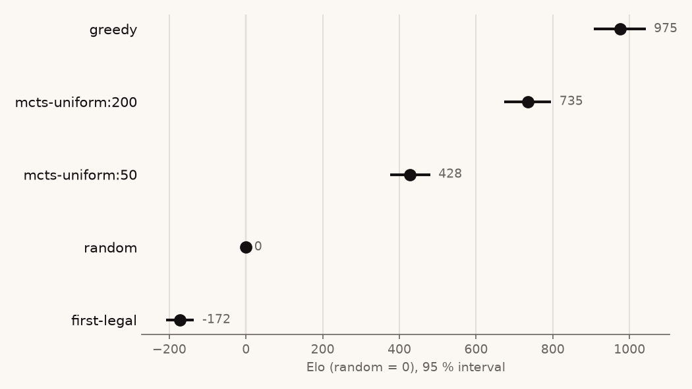

# Elo ladder — scripted and search baselines

Date: 2026-09-27 · Plan task 3.3 · Raw: `v2-ladder-arena.json` (arena reports),
`v2-ladder.json` (fit), `v2-ladder.png` (plot)

Round robin of five players under the uncapped game: 10 pairings, each 200 random
4-ply openings played with colours swapped (400 games), seed 1, safety limit 1,000
plies. Cloud machine (Intel Xeon @ 2.10 GHz, one thread): 2 min 30 s.

```bash
./target/release/arena uncapped random first-legal greedy mcts-uniform:50 mcts-uniform:200 \
  --pairs 200 --seed 1 --out docs/experiments/v2-ladder-arena.json
./target/release/ladder docs/experiments/v2-ladder-arena.json --anchor random --out docs/experiments/v2-ladder.json
uv run tools/plot_ladder.py docs/experiments/v2-ladder.json docs/experiments/v2-ladder.png
```

| Player | Elo | 95 % interval | Games scored |
|---|---|---|---|
| greedy | 975 | [908, 1042] | 1,600 |
| mcts-uniform:200 | 735 | [674, 796] | 1,513 |
| mcts-uniform:50 | 428 | [376, 480] | 1,410 |
| random | 0 | anchor | 1,600 |
| first-legal | −172 | [−209, −135] | 1,361 |



## How to read it

- Bradley–Terry fit by maximum likelihood (`crates/search/src/elo.rs`), random fixed
  at 0. One virtual draw is added per pairing so that clean sweeps (greedy beat
  first-legal 399–1) give a finite gap; it moves no rating noticeably at 400 games.
- The intervals treat games as independent. Arena games come in pairs sharing an
  opening, so they are somewhat too narrow. Between two specific players, the
  arena's own per-pair interval is the stricter test.
- Unfinished games are left out, which is why some players have fewer than 1,600
  games scored. Uniform MCTS often fails to finish off first-legal: 171 of 400 games
  against `mcts-uniform:50` and 68 against `mcts-uniform:200` hit the 1,000-ply
  limit. Those ratings are therefore measured on the games that ended.

## What it says

- The order is the expected one, and every gap is well outside its interval:
  greedy > uniform MCTS 200 > uniform MCTS 50 > random > first-legal.
- A one-move lookahead (greedy) beats 200 simulations of uniform-prior MCTS 81 % of
  the time. Search without a value function is weak here, which is the gap a trained
  network must close.
- This is the baseline ladder that round-2 checkpoints join (plan task 4.2: every
  checkpoint is kept and rated here instead of gated).
