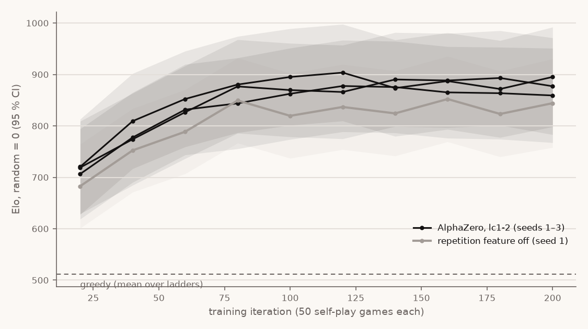

# Round 2 results — AlphaZero under `lc1-2`

Date: 2026-09-28 · Plan tasks 5.1 and 5.2 · Run configuration and the judging rules
fixed before the runs: `v2-az-lc1-run.md` · Raw arena reports and ladders:
`v2-phase5/` · Plot: `v2-az-ladder.png` · Runner: `scripts/phase5-eval.sh`

Ruleset `lc1-2`: a position (board and player to move) that occurs for the third time
loses for the player whose move produced it. Background: `v2-ruleset.md`.

## Verdict

| Criterion (pre-registered in the plan) | Result |
|---|---|
| 1. Final net beats random, greedy, the TD agent and its own 10 % checkpoint, each with CI lower bound > 50 % over ≥ 400 games | **Met on all three seeds** |
| 2. The Elo curve over checkpoints rises and plateaus rather than oscillating | **Not met as pre-registered.** Plateau test passed; the "rises" test failed on every seed (see below) |
| 3. Reproducibility: all three seeds satisfy 1 | **Met.** Score against greedy 0.855–0.887 |
| 4. The owner plays ≥ 10 games in the CLI and writes down what surprised them | **Pending the owner** (hard stop) |

## Training

Three seeds, 200 iterations of 50 self-play games each (10,000 games per seed),
settings in `v2-az-lc1-run.md`. Per-iteration metrics and each run's config are
committed in `v2-az-lc1-runs/`. No self-play game was truncated in any run (the
switch rule never came close). Mean game length in the last iteration: 25–33 plies.
Peak RSS 719–720 MiB per run, close to the pilot's 670 MiB projection. Training time
(sum of iteration times) 36–45 minutes per run, about one hour of wall time with the
arena checks and four runs in parallel on the cloud machine.

## Criterion 1 — final checkpoint against four opponents

Arena, `lc1-2`, 200 random 4-ply openings each played with colours swapped (400
games), arena seed 7 (openings unseen during training), 100 simulations per move.
Score is the final net's, with a 95 % interval over opening pairs.

| Seed | vs random | vs greedy | vs TD agent (same seed, `lc1-2`) | vs own checkpoint at iteration 20 |
|---|---|---|---|---|
| 1 | 1.000 [1.000, 1.000] | 0.855 [0.823, 0.887] | 0.785 [0.750, 0.820] | 0.792 [0.758, 0.827] |
| 2 | 1.000 [1.000, 1.000] | 0.887 [0.858, 0.917] | 0.738 [0.703, 0.772] | 0.790 [0.756, 0.824] |
| 3 | 1.000 [1.000, 1.000] | 0.863 [0.831, 0.894] | 0.743 [0.708, 0.777] | 0.772 [0.737, 0.808] |

Every lower bound is above 0.70. No game was unfinished. Collapse check (distinct
games / distinct positions after the opening, per match):

| Seed | vs random | vs greedy | vs TD | vs iteration 20 |
|---|---|---|---|---|
| 1 | 400 / 3,104 | 389 / 3,758 | 381 / 4,034 | 382 / 4,668 |
| 2 | 400 / 3,058 | 390 / 3,715 | 379 / 3,674 | 380 / 4,306 |
| 3 | 400 / 3,190 | 388 / 3,718 | 380 / 3,899 | 383 / 5,234 |

The 200 random openings of arena seed 7 contain 197 distinct ones (3 drawn twice).

## Criterion 2 — the checkpoint ladder

Per seed, checkpoints at iterations 20, 40, …, 200 each played random, greedy,
`mcts-uniform:200` and the next checkpoint (100 pairs, 50 simulations, arena seed
11). Bradley–Terry fit, random = 0.

| Seed | Iteration 20 | Iteration 200 | Highest | Last three (160 / 180 / 200) |
|---|---|---|---|---|
| 1 | 720 [628, 813] | 895 [798, 992] | 904 at 120 | 887 / 872 / 895 |
| 2 | 706 [619, 794] | 859 [767, 951] | 878 at 120 | 865 / 864 / 859 |
| 3 | 719 [629, 809] | 877 [783, 971] | 893 at 180 | 888 / 893 / 877 |

The tests fixed before the runs:

- **Plateaus rather than oscillates: passed on all seeds.** The last three
  checkpoints' intervals overlap pairwise, and no checkpoint falls below the final
  checkpoint's interval once one has reached its lower bound (iteration 40, 40 and 60).
- **Rises: failed on all seeds.** The test required the final checkpoint's interval
  to lie entirely above the first's. Each final checkpoint rates 153–175 Elo higher,
  but the intervals overlap by 15–27 Elo (for example seed 1: 798 vs 813).

**Why the "rises" test failed — an explanation written after seeing the result, which
does not change the verdict.** Each interval is
measured against random, 700–900 Elo away, so it carries all the uncertainty of that
long distance; two checkpoints' intervals overlap even when the gap between the two
is clear. The test compared the wrong quantities: a difference needs its own
interval. The direct evidence is in criterion 1: each final net beats its own
iteration-20 checkpoint 0.772–0.792 head to head, every lower bound above 0.73, over
400 games. The pre-registered test is reported as failed and stays failed; whether the
direct comparison is enough for the owner is the owner's call, and this report does
not turn it into a "met".

The curve's shape: a steep rise to about iteration 80 (4,000 games) for seeds 1 and 3,
iteration 120 for seed 2, then a flat region. Every checkpoint from iteration 20 on is above greedy, which rates 511–529
on these ladders.

## Criterion 3 — reproducibility

All three seeds meet criterion 1. Spread across seeds: against greedy 0.855–0.887
(0.032), against TD 0.738–0.785 (0.047), against the 10 % checkpoint 0.772–0.792
(0.020). The ladders of the three seeds lie within 40 Elo of each other at every
checkpoint from iteration 40.

## Ablation (task 5.2) — the repetition feature

Seed 1 trained with the repetition feature switched off (`az-lc1-norep-s1`, explicit
override recorded in its config), same settings otherwise.

| Final net, feature off, against | Score [95 % CI] |
|---|---|
| random | 1.000 [1.000, 1.000] |
| greedy | 0.873 [0.842, 0.903] |
| TD agent, seed 1 | 0.748 [0.712, 0.783] |
| the seed-1 net with the feature | **0.500 [0.477, 0.523]** (200–200) |

**No difference detected head to head; a consistent but unmeasured deficit on the
ladders.**

- Head to head the two final nets split 200–200: 0.500 [0.477, 0.523], an Elo gap of
  0 ± 16. That match is dominated by colour: the net without the feature won 151 of
  its 200 games as White and 49 of 200 as Red.
- On the ladders, the net without the feature rates below the same-seed net (seed 1)
  at every checkpoint, by 31–76 Elo, and below the three seeds' mean at every
  checkpoint, by 18–56 Elo. These are separate ladders, each anchored to random, so
  the gap is not a measured difference: every value sits inside the intervals.
- Its own ladder also fails the "rises" test (overlap of 6 Elo) and passes the plateau
  test, like the three seeds.

So the plan's question ("the Elo gap measured") has this answer: head to head, 0 ± 16
Elo; indirectly, a gap of 30–75 Elo in the feature's favour that the ladders cannot
resolve. A plausible reason the feature matters little, not tested: third occurrences
are rare in these short games, so the feature is almost always zero.

## Colour balance

After a random 4-ply opening, White wins more often, whoever plays it. In the
criterion-1 matches between nets and greedy or TD, White scores 0.59–0.66; in the
ablation head-to-head 0.755; on the ladders 0.50–0.79 (mean 0.58). Every score in this
report is over colour-swapped pairs, so it is not biased by this, but the advantage
matters for anyone reading a single game, and for criterion 4.

## What these results do not show

- Strength against people. Criterion 4 is the only human check, and it is pending.
- Anything about the uncapped game: those runs were stopped by the switch rule
  (`v2-az-uncapped.md`) and are not compared with these.
- Anything about the owner's M2: every number here is from the cloud machine.
- The ladder intervals assume independent games; arena games come in pairs sharing an
  opening, so they are somewhat too narrow.

## Independent audit (task 5.3)

A fresh-context agent, given only the plan, the run configuration and the raw JSON,
checked this report on 2026-09-28. It refitted all four ladders from the 156 raw
ladder reports (maximum difference 0.00 Elo), recomputed every number, and confirmed
that the judging rules were committed before the results and not edited afterwards.
It found nothing blocking. Its notes and what was done:

| Note | Resolution |
|---|---|
| Colour balance not reported | Section added above |
| Distinct positions given only as a range, though the rules say "for each match" | Per-match table added |
| 197 distinct openings of 200 not stated | Stated under criterion 1 |
| Training figures not checkable from the repository | Metrics and configs committed in `v2-az-lc1-runs/` |
| The explanation of the failed "rises" test is post hoc | Labelled as such; the verdict stays "not met" |
| "Rise to about iteration 80" does not fit seed 2 | Corrected (seed 2: iteration 120) |
| "No measurable effect" overstates the ablation; the Elo gap was not given; the same-seed comparison was missing; the ablation's own "rises" failure was not mentioned | Ablation section rewritten with all four |
| CLAUDE.md still says round 2 trains on the uncapped game | Not so: CLAUDE.md already names `lc1-2` (project rules). No change |

