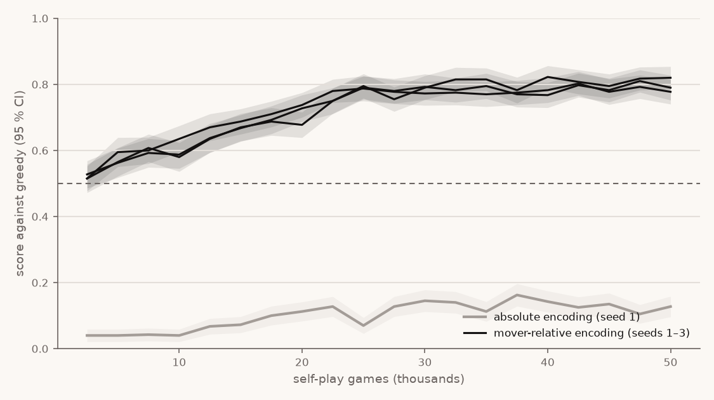

# TD(λ) value learning — plan task 4.1

Date: 2026-09-27 · Raw: `v2-td.json` (evaluation curves, configs, arena
confirmation) · Plot: `v2-td.png` · Code: `crates/train/src/td.rs`, binary `td_train`

**Result: the criterion is met.** A TD-trained value net playing one move ahead beats
greedy with the 95 % interval's lower bound above 50 %, on three seeds, confirmed on
fresh openings. The first attempt failed; the failure is documented below, because it
is the more instructive half.

## Method

- Uncapped game, 1,000-ply safety limit. MLP value net V(s) ∈ [−1, 1] for the player
  to move, hidden layers 128 and 64, ReLU, tanh output.
- Play: each legal move is scored by the exact result if it ends the game, otherwise
  by −V(next position). Self-play samples from a softmax over these scores; the
  temperature decays geometrically from 0.5 to 0.02 over the run. Evaluation plays
  the best-scored move (temperature 0).
- Learning: λ-returns computed after each game with the current net,
  G_t = −[(1 − λ)·V(s_{t+1}) + λ·G_{t+1}], with the exact outcome at the end. A
  truncated game bootstraps from V at the cut, as TD does. One pass of plain SGD
  (batch 64) per iteration of 50 games.
- Resumable: weights, counters and the generator state are saved after every
  iteration; tests show a run extended in two parts, or interrupted and resumed,
  ends bit-identical to an uninterrupted run (`tests/td_resume.rs`,
  `tests/td_interrupt.rs`). Weights are initialised from the run's own seed, not
  libtorch's shared generator, which is what made that possible.
- Evaluation during training: every 50 iterations, 200 arena pairs (400 games, random
  4-ply openings, colours swapped) against greedy and random, arena seed 1.
- Cloud machine (Intel Xeon @ 2.10 GHz, one thread per run): 50,000 games plus
  evaluations in under 2 minutes per run; peak RSS 282 MiB in the pilot.

## First attempt: the net learned nothing useful

With the AlphaZero input encoding (12 slots per cell in absolute colours, bottom to
top, plus the player to move), λ = 0.7 and learning rate 0.01, 50,000 games gave
0.04 against greedy throughout (random: 0.94). A diagnostic on 10,702 positions from
random games found the net's values almost constant (standard deviation 0.03) and
uncorrelated with material (correlation with "own stacks on top minus the
opponent's": 0.08).

A 2 × 2 sweep at 10,000 games (λ ∈ {0.7, 1.0}, learning rate ∈ {0.01, 0.1}) stayed
between 0.035 and 0.07 against greedy, so it was not the step size.

## The fix: say who owns each stack

In the absolute encoding the fact the rules turn on, who owns a stack, sits in a
different input slot for every stack height, and the net must also learn to flip
everything by the player to move. The **mover-relative** encoding restates the same
board: per cell, 12 slots seen from the player to move (+1 own, −1 opponent's, 0
empty), the top's owner and the height. It adds no strategy, only a fixed place for
ownership.

Same sweep with it, 10,000 games, seed 1:

| λ | learning rate | vs greedy [95 % CI] |
|---|---|---|
| 0.7 | 0.01 | 0.448 [0.398, 0.497] |
| 0.7 | 0.1 | **0.663 [0.620, 0.707]** |
| 1.0 | 0.01 | 0.510 [0.466, 0.554] |
| 1.0 | 0.1 | 0.580 [0.535, 0.625] |

λ = 0.7 and learning rate 0.1 were chosen **on seed 1**. Seeds 2 and 3 played no part
in the choice.

## Results at 50,000 games

| Run | vs greedy (training eval) | vs greedy, fresh openings (arena seed 7) | vs random, fresh openings | Truncated self-play games |
|---|---|---|---|---|
| mover-relative, seed 1 (selection) | 0.777 [0.740, 0.815] | 0.772 [0.735, 0.810] | 0.998 [0.993, 1.000] | 30 of 50,000 |
| mover-relative, seed 2 | 0.790 [0.752, 0.828] | 0.757 [0.719, 0.796] | 1.000 [1.000, 1.000] | 45 |
| mover-relative, seed 3 | 0.820 [0.786, 0.854] | 0.775 [0.736, 0.814] | 0.998 [0.993, 1.000] | 60 |
| absolute, seed 1 (same settings) | 0.128 [0.096, 0.159] | — | 0.975 (training eval) | 1 |



- All three mover-relative seeds rise from about 0.52 at 2,500 games to a plateau near
  0.78–0.82 from about 25,000 games. The spread between seeds is small.
- Against fresh openings the scores are 0.757–0.775, slightly below the training
  evaluation, all with lower bounds above 0.71. No collapse: 387–388 distinct games
  out of 400, and 3,600–3,760 distinct positions after the openings against greedy.
- With the same settings, the absolute encoding reaches 0.13. The encoding, not the
  settings, is the difference.
- The trained net's values now track material (correlation 0.57, standard deviation
  0.57, same 10,702 positions) without being told about it; its chosen move matches
  greedy's best material move 67 % of the time (absolute encoding: 35 %).
- Truncation stayed far below the 5 % switch threshold: at most 60 of 50,000
  self-play games (0.12 %).

## Consequence for AlphaZero (task 4.2)

The AlphaZero net uses the absolute encoding that failed here. The same restatement
should be tried there, and measured, not assumed: 4.2 runs it as a comparison.

```bash
./target/release/td_train models/td-mr-s1 --iterations 1000 --temp-decay 1000 --eval-every 50 \
  --eval-pairs 200 --checkpoint-every 50 --lambda 0.7 --lr 0.1 --seed 1
./target/release/arena uncapped td:models/td-mr-s1/weights.pt greedy random --pairs 200 --seed 7
uv run tools/plot_td_curve.py docs/experiments/v2-td.json docs/experiments/v2-td.png
```

## Under `lc1-2` (after the ruleset switch)

When round 2 moved to `lc1-2` (`v2-ruleset.md`), the TD baseline was retrained with
the same settings (λ 0.7, learning rate 0.1, 50,000 games) and the
`mover-relative-repetition` features, so that it plays the ruleset it is compared on.
Raw data: `lc1_2_runs` in `v2-td.json`.

| Seed | vs greedy (training eval) | vs greedy, fresh openings (arena seed 7) | vs random, fresh openings | Truncated self-play games |
|---|---|---|---|---|
| 1 | 0.800 [0.763, 0.837] | 0.785 [0.748, 0.822] | 1.000 | 0 of 50,000 |
| 2 | 0.810 [0.774, 0.846] | 0.740 [0.702, 0.778] | 1.000 | 0 |
| 3 | 0.793 [0.754, 0.831] | 0.777 [0.741, 0.814] | 1.000 | 0 |

The criterion holds under `lc1-2` too. These are the TD agents the AlphaZero
criterion 1 compares against (`models/td-lc1-sN`).
